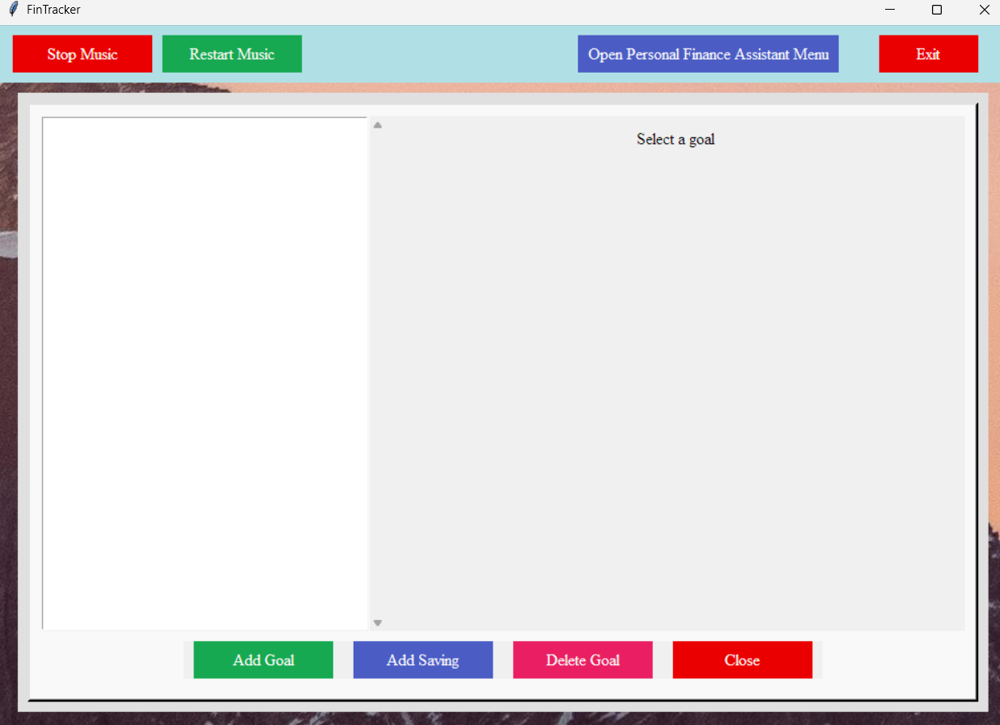
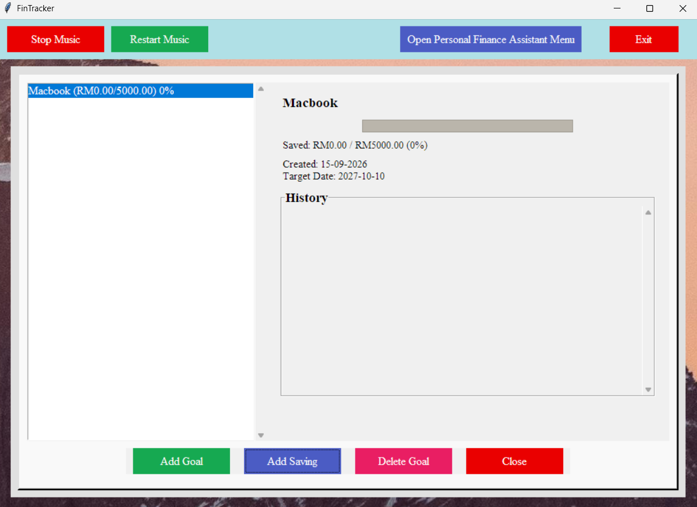
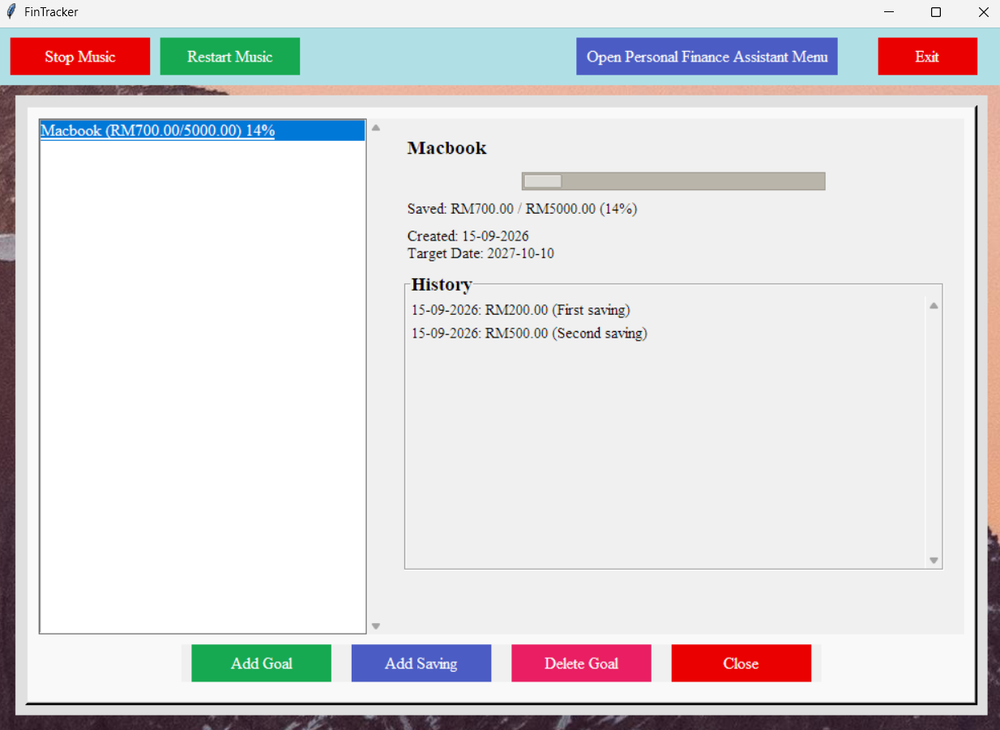

## Project Overview
The Finance Management System is designed to help users manage their personal finances. 
The system provides functions for tracking expenses, planning budgets, managing savings goals, and estimating taxes.

## Features
- User Login and Registration
- User and Admin Roles
- Expense Tracking
- Expense Filtering by Date and Month
- Expense Category Summary and Visualization
- Budget Planner
- Savings Goal Tracker
- Simple Tax Estimator
- Tax History Management
- File-based Data Storage

## Technologies Used
- Python
- Tkinter
- JSON
- File Handling

## My Contribution
I was mainly responsible for developing the Savings Goal Tracker, which allows users to create savings goals, 
set target amounts and dates, track their current savings progress, add savings records, and view their savings history. 
I also contributed to improving the UI by designing and arranging the interface elements to make the system more organized and user-friendly.n handling.

## Project Structure
- `fintracker.py` - Main Python source code.
- `budget.txt` - Stores budget information.
- `savings_goals.json` - Stores savings goal data.
- `tax_history.json` - Stores tax calculation history.
- `users.txt` - Stores user information.
- `user_expenses.txt` - Stores expense records.
- `bg1.png` - Application background image.
- `fintracker.png` - Application image.
- `just_relax.wav` - Background music.

## Screenshots
### Savings Goal Tracker Menu

### After add goal

### After add saving

## User Roles
The system provides two types of user roles:
- **User Role** – Allows users to access and manage their personal financial information, including expense tracking,
                  budget planning, savings goals, and tax estimation.
- **Admin Role** – Provides access to administrative functions and requires a predefined username and password.
                   The admin login credentials can be found in `users.txt`.
  
## How to Run
1. Clone this repository.
2. Make sure Python is installed.
3. Open the project in another Python IDE.
4. Run `fintracker.py`.
